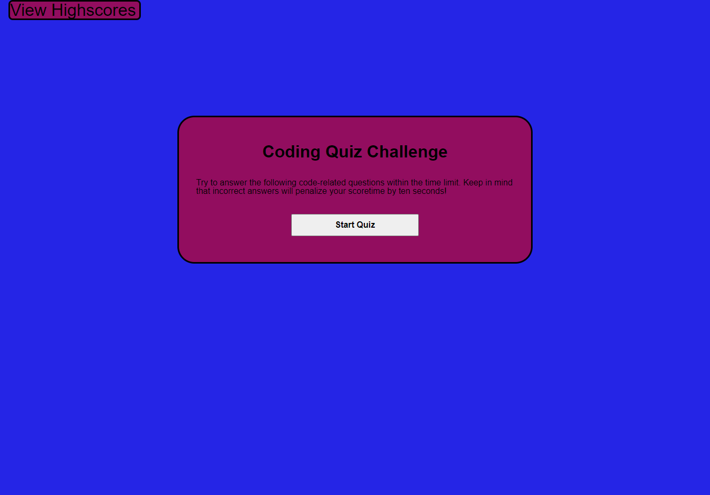

# Alex Clayton's Multiple Choice Quiz

## Introduction
This project was developed by Alex Clayton as part of the KU Coding Bootcampt 04-Web-APIs Challenge.  This is a multiple choice quiz web application using javascript functions to add interactivity to various elements of the application.  It is styled with CSS as well as a reset for incompatible browsers.

## What's in the project?
The acceptance criteria for this project are as follows:

1.  WHEN I click the start button
    THEN a timer starts and I am presented with a question

    The timer took a lot of work but I finally got it working with some tips from our TA.

2.  WHEN I answer a question
    THEN I am presented with another question

    I was stuck on this one for a while but ended up adding an onclick event to the buttons created dynamically with JavaScript in the displayQuestion() function.

3.  WHEN I answer a question incorrectly
    THEN time is subtracted from the clock

    Another snag in development that the TA assisted me with.

4.  WHEN all questions are answered or the timer reaches 0
    THEN the game is over

    Achieved using JavaScript logic.  Not the most difficult part of the challenge, but a challenge nonetheless.

5.  WHEN the game is over
    THEN I can save my initials and my score

    Another area of difficulty that the TA assisted with
    
## The completed project resembles the following image when deployed:

Full Size desktop view

## URL of the Deployed Application:

[Deployed Application](https://alexclaytonbootcamp.github.io/Module-4-Challenge-Quiz/)

## Acknowledgements
Shoutout to one of the course TAs Joshua Diehl.  He assisted me with some debugging during office hours and took the time to clone my repo to his local machine, look it over, and send me a zipped file with comments/tips.  His returned advice is included in the 2nd half of the test.js file.  I've added initials at the end of each of the comments to indicate which one of us did the commenting.